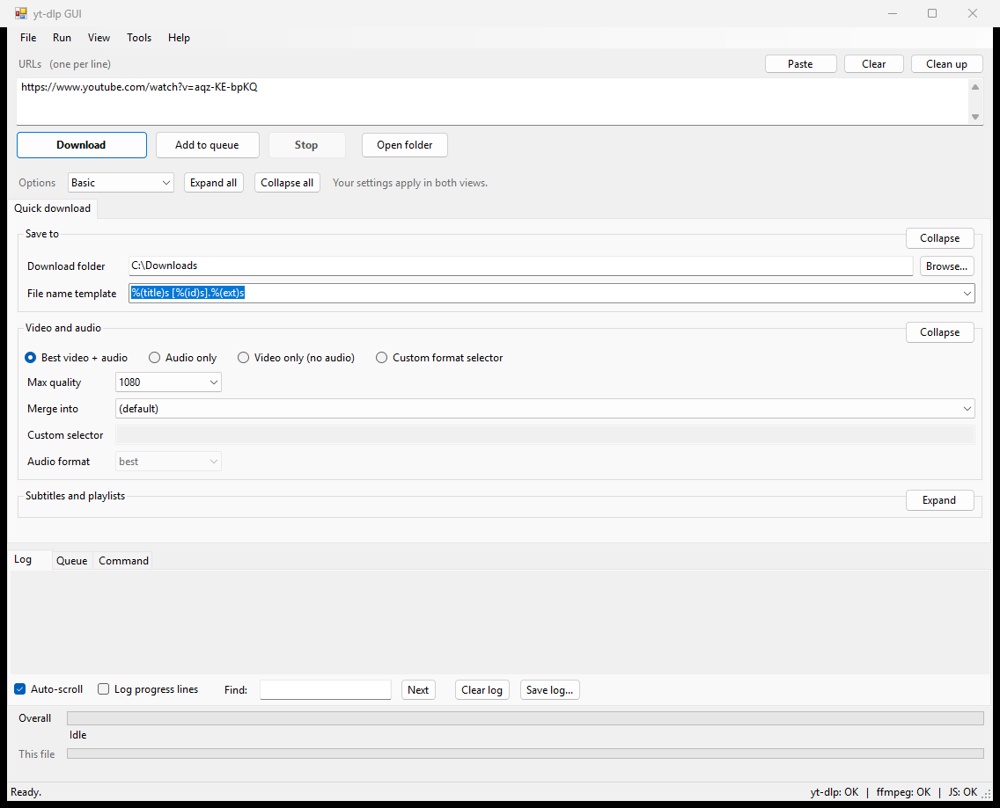
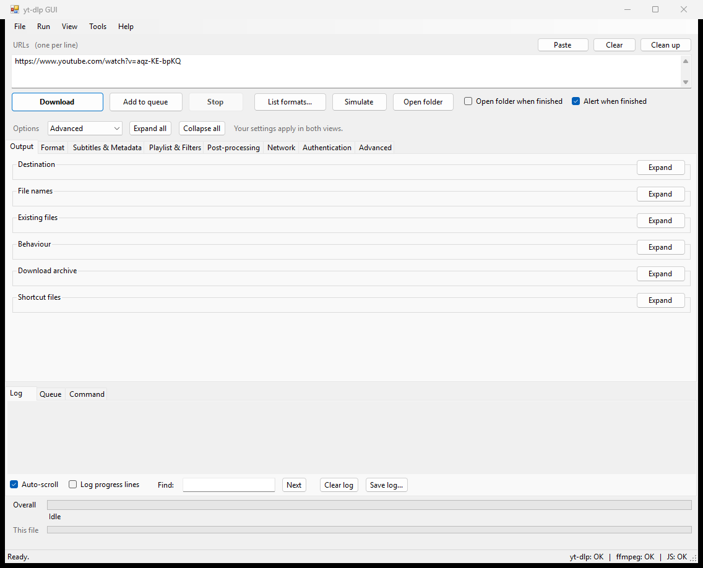

# yt-dlp GUI

**Download videos, audio and playlists from a small, portable Windows app.**

A native Windows Forms front end for [yt-dlp](https://github.com/yt-dlp/yt-dlp). Start with the everyday controls in **Basic** mode, then switch to **Advanced** whenever you need more control. A small C# executable, standard Windows controls, and your tools in one folder.



*Basic mode. Groups start collapsed; open just the options you need.*

[Quick start](#quick-start) · [Features](#features) · [Advanced mode](#advanced-mode) · [Updates](#updates) · [Build from source](#build-from-source)

## Why this app?

- **Lightweight:** the GUI executable is under 300 KB. The downloader, FFmpeg and JavaScript runtime are separate and make a complete bundle larger.
- **Portable:** no installer. Put the app and its tools in a folder and run it. Settings stay alongside the executable when that folder is writable.
- **A calm starting point:** Basic mode brings destination, quality, audio, subtitles and playlist choices into one tab.
- **Full control when needed:** Advanced mode keeps all eight option tabs, the format picker, command preview and extra arguments.
- **Native Windows UI:** ordinary buttons, fields, menus and keyboard shortcuts. No embedded browser or Electron runtime.
- **Built-in downloader updates:** run yt-dlp's self-updater from the Tools menu when your yt-dlp distribution supports it.

## Quick start

1. Put `yt-dlp-gui.exe` and a compatible yt-dlp executable in the same folder. Add `ffmpeg.exe`, `ffprobe.exe` and a supported JavaScript runtime for the full workflow.
2. Open **yt-dlp-gui.exe**.
3. Paste one or more links, one per line.
4. Expand **Save to** to choose your download folder. Expand **Video and audio** to choose quality or audio-only output.
5. Click **Download**, or press **F5**.

Use **Open folder** to find your files. For several jobs with different options, choose the options for each job and click **Add to queue** before starting the queue.

### What goes in the folder?

```text
yt-dlp-gui.exe
yt-dlp.exe          # yt-dlp_x86.exe is also recognised
ffmpeg.exe
ffprobe.exe
deno.exe
```

The app also searches a `bin` subfolder and your `PATH`. **Tools → Check dependencies** (`F2`) shows what it found. The status bar reports whether the downloader, FFmpeg and a JavaScript runtime are available.

The GUI targets **.NET Framework 4.x on Windows**. Use downloader and dependency builds compatible with your Windows version and architecture. The standalone yt-dlp executable does not need a separate Python installation; see the [upstream installation guide](https://github.com/yt-dlp/yt-dlp#installation) for its current requirements and release variants.

## Features

| Task | What you can do |
| --- | --- |
| Video and audio | Choose a quality cap, extract audio, select an output container, or enter a custom format selector. |
| Batch downloads | Paste multiple URLs, drag in links or a text file, and clean up blank lines, comments and duplicates. |
| Queue management | Keep separate settings per entry; reorder, remove, retry, or copy a queued command. |
| Playlists | Download a whole playlist, one video, or selected item ranges. |
| Format picker | Inspect formats, codecs, sizes and bitrates; sort columns; select separate video and audio streams to merge. |
| Subtitles and metadata | Download or embed subtitles, include automatic captions, save thumbnails, and embed metadata or chapters. |
| Post-processing | Remux or re-encode media, extract audio, split chapters, download sections, and configure SponsorBlock. |
| Connections and authentication | Configure proxies, rate limits, retries, cookies, browser cookies and credentials. |
| Progress | Follow the current file and the overall queue/playlist, with speed, ETA, fragments and taskbar progress. |
| Profiles | Save and load named option sets; restore defaults when you want a fresh start. |
| Command visibility | Inspect the generated command, copy it, export a `.bat` file, or simulate a download. |
| Desktop integration | Keep the computer awake during downloads, optionally open the output folder, or alert when the queue finishes. |

Site support and available formats come from yt-dlp and the source site. See yt-dlp's [supported sites](https://github.com/yt-dlp/yt-dlp/blob/master/supportedsites.md).

## Basic and Advanced modes

Use the **Options** selector above the tabs to switch modes. The app remembers your choice.

**Basic** shows three groups:

- **Save to:** download folder and filename template.
- **Video and audio:** download type, quality cap, container, custom selector and audio format.
- **Subtitles and playlists:** subtitle options, languages, playlist handling and item selection.

**Advanced** shows every option. Switching views preserves your settings, and advanced options you have configured continue to apply in Basic mode. The **Command** tab shows the generated command in either mode; **File → Reset all options** restores defaults.

Every options group starts **collapsed** when the app opens. Use its **Expand** button or click its heading to open it. **Expand all** and **Collapse all** apply across the option tabs in the current mode. Buttons work with the keyboard too.

The app stays on its opening tab during startup. Other tabs are laid out when you visit them.

## Advanced mode



| Tab | Options |
| --- | --- |
| Output | Destination, filenames, overwrite and resume rules, download archives. |
| Format | Quality, codecs, audio extraction, containers, format sorting and live streams. |
| Subtitles & Metadata | Captions, thumbnails, chapters, metadata and info JSON. |
| Playlist & Filters | Playlist items, dates, sizes, match filters and sections. |
| Post-processing | SponsorBlock, FFmpeg, fixups and custom post-processing. |
| Network | Proxies, speed limits, retries, headers and downloaders. |
| Authentication | Cookies, browser cookies, login, `.netrc` and certificates. |
| Advanced | Logging, configuration, cache, extractors, plugins and raw arguments. |

### Exact formats and command lines

Use **List formats…** (`Ctrl+F`, also available from the Run menu in Basic mode) to query the first URL. Select a video row and an audio row together, or use **Best video + audio**. The picker shows an estimated size when the site supplies enough information.

The **Command** tab shows what will run. **Copy command** puts it on the clipboard; **Save as .bat** exports a batch file. **Run → Simulate** resolves the request without downloading the media.

For options without a dedicated control, use **Advanced → Raw extra arguments**: one argument per line, without surrounding quotes. These follow the GUI-generated options so you can override them.

## Updates

Choose **Tools → Update yt-dlp** to invoke the downloader's built-in `-U` self-updater. Progress and errors appear in the log. Finish or stop active downloads before updating.

This is a **user-initiated downloader update**. The GUI does not schedule unattended updates or update itself, FFmpeg or Deno. Some unpackaged or package-managed yt-dlp distributions cannot self-update; use their original installation method instead. See the [yt-dlp update documentation](https://github.com/yt-dlp/yt-dlp#update).

## Settings and profiles

- **File → Save profile / Load profile** saves reusable sets of options.
- **File → Reset all options** restores the startup defaults.
- The app remembers options, interface mode, window position, window size and splitter position. Groups start collapsed on each launch.
- Settings are stored in `ytdlp-gui.settings` beside the executable when writable, otherwise in `%APPDATA%\yt-dlp-gui`.
- **Ignore yt-dlp config files** is enabled by default. Disable it in Advanced mode if you want to use your own yt-dlp configuration.
- Credentials entered into the form are stored as plain text in settings and profiles. Avoid sharing those files or command exports containing private values.

## Keyboard shortcuts

| Shortcut | Action |
| --- | --- |
| `F5` / `Ctrl+Enter` | Download |
| `Ctrl+D` | Add URLs to the queue |
| `Esc` | Stop the download and its child processes |
| `Ctrl+F` | List formats for the first URL |
| `Ctrl+Shift+S` | Simulate |
| `Ctrl+1` / `Ctrl+2` / `Ctrl+3` | Log / Queue / Command |
| `Ctrl+Shift+C` | Copy command |
| `Ctrl+O` | Open download folder |
| `Ctrl+S` / `Ctrl+P` | Save / load profile |
| `Ctrl+L` / `F3` | Clear log / find next match |
| `F2` / `F1` | Check dependencies / show shortcuts |

## Troubleshooting

**The app cannot find yt-dlp.** Place a recognised executable beside the GUI or in `bin`, or add its folder to `PATH`. Then use **Tools → Check dependencies**.

**Merging or audio extraction fails.** Check that FFmpeg is available. The dependency check and log show the detected paths and any tool errors.

**Formats are missing or extraction fails.** Check the log, update yt-dlp if supported, and confirm a compatible JavaScript runtime is present. The format picker also exposes the downloader's diagnostic output.

**A setting seems to have no effect.** Inspect the Command tab. A custom selector, preset, extra argument or external configuration can override another choice.

**The window is slow to resize on a remote desktop.** Close the app and set `smoothPainting=0` in `ytdlp-gui.settings` to disable whole-window compositing.

## Build from source

From the project folder, run:

```powershell
powershell -NoProfile -ExecutionPolicy Bypass -File build.ps1
```

The script uses the .NET SDK's Roslyn compiler when available, otherwise the .NET Framework C# compiler. It writes `yt-dlp-gui.exe` in the repository root, with the application icon embedded. Use `-OutPath` to choose a different output path. No NuGet packages are required.

| Source | Responsibility |
| --- | --- |
| `MainForm.cs` | Main window, queue, logging, settings and process coordination. |
| `MainForm.Modes.cs` | Basic/Advanced views and expand/collapse actions. |
| `MainForm.Tabs.cs` | Option controls. |
| `MainForm.Args.cs` | Build downloader arguments from the controls. |
| `Ui.cs` | Native controls, collapsible groups and layout helpers. |
| `Runner.cs`, `Progress.cs` | Process handling, output parsing and progress tracking. |
| `FormatsForm.cs`, `Json.cs` | Format picker and JSON parsing. |
| `App.cs`, `Settings.cs`, `Native.cs`, `Program.cs` | Tool discovery, persistence, Windows integration and startup. |

### Tests

```powershell
# Offline parser, settings and progress tests
powershell -NoProfile -ExecutionPolicy Bypass -File tests\run-tests.ps1

# Also exercise the actual Windows UI and capture screenshots
powershell -NoProfile -ExecutionPolicy Bypass -File tests\run-tests.ps1 --ui

# Also perform real network downloads and test the format picker
powershell -NoProfile -ExecutionPolicy Bypass -File tests\run-tests.ps1 --net --ui
```

UI tests check startup tab stability, mode switching without lost settings, collapsible groups, command previews, queue operations and progress display. They back up and restore the settings file and write screenshots to `tests/shots`.

## Help improve it

Bug reports, small fixes and usability suggestions are welcome. For a useful report, include your Windows version, yt-dlp version, reproduction steps and the relevant log lines, with private data removed.

If this app makes your downloads easier, a GitHub star helps other people discover it.

Built on [yt-dlp](https://github.com/yt-dlp/yt-dlp), with [FFmpeg](https://ffmpeg.org/) for media processing. The GUI is an independent front end; those projects and bundled dependencies retain their own licenses.
